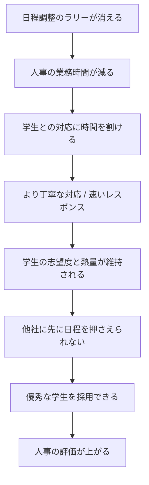
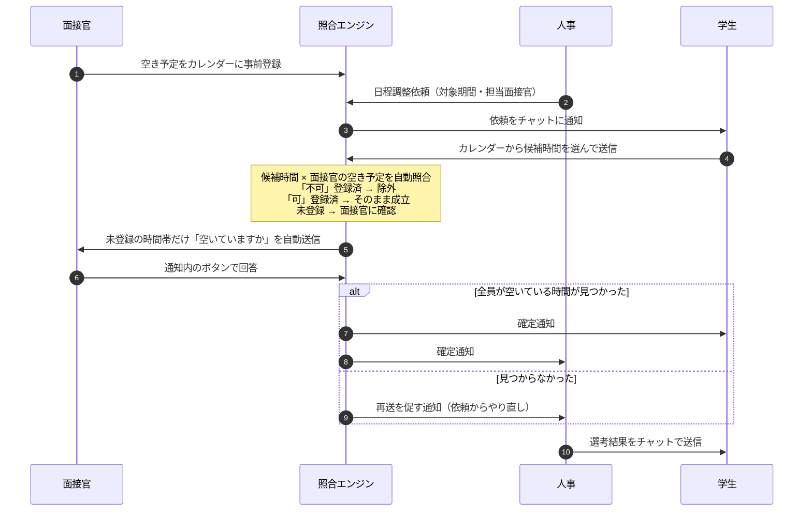

# ミツカル採用

**面接の日程調整を、チャット上で自動的に成立させる新卒採用管理アプリ。**

学生・人事・面接官の3者が同じチャットで完結し、サーバー側の照合エンジンが「学生の候補時間 × 面接官の空き予定」を突き合わせて、日程を自動で確定させます。

3日間のハッカソン（2026年9月）で、**何を作るかを決めるところから**チームで企画・実装したものです。

<!--
  ▼ここにスクリーンショット / デモ動画を追加する
  例:
  
-->

| | |
|---|---|
| **形式** | 3日間のハッカソン（課題設定・技術選定・実装すべて参加者が決定） |
| **チーム** | 4名 |
| **期間** | 2026-09-02 〜 2026-09-04 / 90コミット |
| **技術** | Vue 3 + Vuetify 3 / Socket.IO / Supabase (PostgreSQL) / Vite |
| **開発手法** | AI駆動開発（実装・コードレビューとも AI。Claude Code / GitHub Copilot） |

---

## 背景 — 人事にヒアリングして課題を決めた

テーマが与えられていなかったので、まず解くべき課題を選ぶところから始めました。人事の方にヒアリングして出てきたのが、この話です。

> 学生一人ひとりに丁寧に対応したい。でも、面接の日程調整のような**学生以外とのやり取り**に時間を取られて、そこに時間を割けていない。

新卒採用の現場では、人事が面接を1件組むために

> 学生に候補日を聞く → 面接官に空きを確認する → 合わなければもう一度学生に聞く

というチャットのラリーを何往復も繰り返しています。**このラリーをなくすこと**を、このアプリのゴールに置きました。

## 価値の設計 — 日程調整を速くすると、最後に何が起きるか

「日程調整が楽になる」で止めずに、それが最終的に誰の何に効くのかをチームで徹底的に詰めました。**機能を作るかどうかの判断は、すべてこの連鎖に効くかどうかで決めています。**



このアプリが直接触るのは左端のひとつだけです。ただ、そこを解くと右端まで繋がる。だから「人事が今日やるべきことが一目で分かる」ダッシュボードと、「面接官の返信を待たずに済む」自動照合を優先しました。

## 進め方 — 動くモックで認識を合わせ、終盤は画面を共有して全員で作る

1. **最初に動くモックを作った。** 仕様書ではなく実際に触れるものを先に置くことで、「何を作るのか」の認識をチーム全員で合わせてから着手した
2. **そのうえで個人作業に分かれた。** 認識が揃っているので、並行して進めてもズレが出にくい
3. **終盤は画面を共有しながら全員で開発した。** UI をどうするかも含め、その場で見て決めていった

3 が想像以上に効きました。AI が実装を返す速度が速いぶん、**ボトルネックは「どうするかを決めること」に移ります。** 全員で同じ画面を見てその場で即断すれば、そのボトルネックが消える。認識合わせのための会議も、実装後の手戻りも要らなくなりました。AI 時代の進め方として、これが一番の発見でした。

## 何ができるか

| ロール | できること |
|---|---|
| **面接官** | 自分の空き予定を「日付 × 時間帯」のカレンダーに事前登録する。届いた確認通知にボタンで答える |
| **人事** | 学生ごとに日程調整依頼（対象期間・担当面接官）を送る。「今日やること」ダッシュボードで全学生の進行状況を追う。選考結果をチャットからそのまま送る |
| **学生** | チャット上に出るカレンダーから、対象期間内の都合のいい時間を選んで送る |

実メールは一切送りません。すべての通知はアプリ内チャット（Socket.IO）で完結します。

## 自動照合の仕組み

このアプリの中核です。サーバー側の照合エンジン `server/matching.js` が担当します。



### 設計で判断したこと

- **面接官の返信本文からは可否を判定しない。** 「空いていません」を肯定と取り違えるため、回答として扱うのは通知内のボタンだけにした。自然文の解釈に頼らないほうが壊れない
- **確定の直前にダブルブッキングを再確認する。** 照合の時点では空いていても、承認までの間に別の面接が入る可能性があるため
- **複数の面接官が指定された場合は、全員が空いている時間だけを確定とする**
- **チャットは会話ごとの Socket.IO room。** ベース雛形の「全クライアントへの broadcast」方式は廃止し、学生ごと1本・面接官ごと1本の常設スレッドに作り替えた

## 技術構成

| 層 | 使用技術 |
|---|---|
| フロントエンド | Vue 3 (Composition API) / Vuetify 3 / Vue Router / Vite |
| リアルタイム通信 | Socket.IO（会話ごとの room） |
| サーバー | Vite の `configureServer` 内に Socket.IO サーバーを同居。ログインのみ `/api/login` を connect ミドルウェアで追加 |
| DB | Supabase (PostgreSQL) — 8テーブル（`sql/schema.sql`） |
| 認証 | bcrypt でハッシュ化したパスワード + JWT。Socket 接続時に `io.use()` で検証し `socket.data.user` に載せる |
| テスト | Node 標準テストランナー（`node --test`、追加依存なし） |

DB アクセスは `server/repositories/` にリポジトリ層として分離しています。テストではこの下の Supabase クライアントだけをインメモリ実装（`tests/helpers/fakeSupabase.js`）に差し替えるので、**DB 以外は本番と同じコードが動きます。**

## AI駆動開発について

このハッカソンは AI コーディングアシスタントの活用を前提とした形式でした。**今回は「顧客の課題を解決すること」を主目的に置いたため、実装は完全に AI に任せ、メンバーは一行もコードを書いていません。コードレビューも AI に行わせています。**

- 90コミット中 **44コミット**に Claude の `Co-Authored-By` トレーラー、**8コミット**に GitHub Copilot
- `SESSION_HANDOFF.md` は、AI セッションをまたいで作業を引き継ぐためのサマリー。確定した設計判断と変更ファイルの一覧を、次のセッションに渡す前提で構造化したものです

人間が持ったのは、**何を作るか / それが誰にどう効くか / どの順で決めるか** の判断です。手を動かす時間を実装から引き上げたぶんを、上の「価値の設計」と「進め方」に振りました。

## 自分の担当範囲

チーム全体90コミットのうち **43コミット / +8,112 −1,742行** を担当しました（チーム最多）。実装は AI が書いているので、以下は**どの領域を自分が持って進めたか**の内訳です（数字は git 履歴の実測）。

**一人で担当した領域**

- **テスト一式**（`tests/matching.test.js` / `tests/socketFlow.test.js` / `tests/e2e/scenario.test.js`、約1,800行 — 全て自分）
  照合エンジンの業務シナリオ、Socket.IO の実サーバー・実クライアント通し、実DBに対するE2E
- **人事ダッシュボード**（`HrDashboardPage.vue` — 自分1,809行 / 他77行）
  全学生の進行状況と「今日やること」キュー
- **面接官の空き予定カレンダー**（`InterviewerCalendar.vue` — 自分542行 / 他93行）
  下書きしてから保存する方式、確定済み面接の重畳表示、過去日時の編集防止
- **面接官側の Socket ハンドラと通知ストア**（`socket_event/interviewer.js` — 自分158行 / 他92行）

**チームで分担した領域**

- **照合エンジン**（`server/matching.js` — 自分379行 / 他2名232行）
  可否の誤判定の修正と、確定直前のダブルブッキング再確認を担当
- **学生チャット**（`StudentChat.vue` / `ChatCalendarCard.vue` / `CalendarPicker.vue`）
  カレンダーからの候補提出まわり

認証（`server/auth.js`）と DB スキーマ（`sql/schema.sql`）は他のメンバーの担当です。

## テスト

```bash
npm test          # DBに依存しないテスト（単体 + 照合エンジン + Socket.IO）
npm run test:e2e  # 実際のDBと開発サーバーに対する通しテスト
```

| ファイル | 内容 |
|---|---|
| `tests/unit/` | 認証、面接官の通知ストア |
| `tests/matching.test.js` | 照合エンジン。候補提出 → 空き確認 → 承認 → 確定、見送り、ダブルブッキング防止、複数学生の同時進行を、リポジトリ層まで本物のコードで検証 |
| `tests/socketFlow.test.js` | Socket.IO ハンドラを実サーバー・実クライアントで通しで検証 |
| `tests/e2e/scenario.test.js` | 実 Supabase と開発サーバーに対する業務シナリオ。人事のアカウント作成から空き登録・一括送信・候補提出・承認・確定・結果報告までを本番と同じ経路でなぞる |

## セットアップ

Node.js 22 LTS が必要です。

```bash
npm install

# Supabase のプロジェクトを用意し、sql/schema.sql を SQL Editor で実行する
cp .env.sample .env
#   SUPABASE_URL / SUPABASE_SERVICE_ROLE_KEY / JWT_SECRET を設定する

npm run seed        # 動作確認用のテストアカウントを投入（任意）
npm run demo:seed   # ダッシュボードのデモデータを投入（任意）
npm start           # http://localhost:3000/
```

DB の実データを触る前にバックアップを取れます。復元まで動作確認済みです。

```bash
npm run db:backup                     # backups/<日時>/ に全テーブルをJSONで保存
npm run db:restore -- backups/<日時>   # その時点の状態に戻す
```

`backups/` はメールアドレスやパスワードハッシュを含むため git 管理外です。

## このリポジトリについて

- ハッカソンの成果物を、**主催企業の許諾を得たうえで**公開しています。無断公開ではありません
- ベースとなったチャットアプリの雛形（Vite + Vue 3 + Vuetify + Socket.IO の単一チャット）は主催企業から提供されたもので、その部分の著作権は同社に帰属します。詳細は [LICENSE](LICENSE) を参照してください
- **主催企業名は記載していません**
- 公開にあたり、主催企業が配布した研修資料は除外し、コミット履歴に含まれていたチームメンバーの個人メールアドレスは GitHub の noreply アドレスに置き換えています
- リポジトリに認証情報は一切含まれていません（`.env` は git 管理外、`.env.sample` はプレースホルダのみ）
