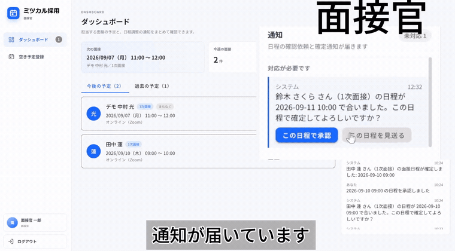
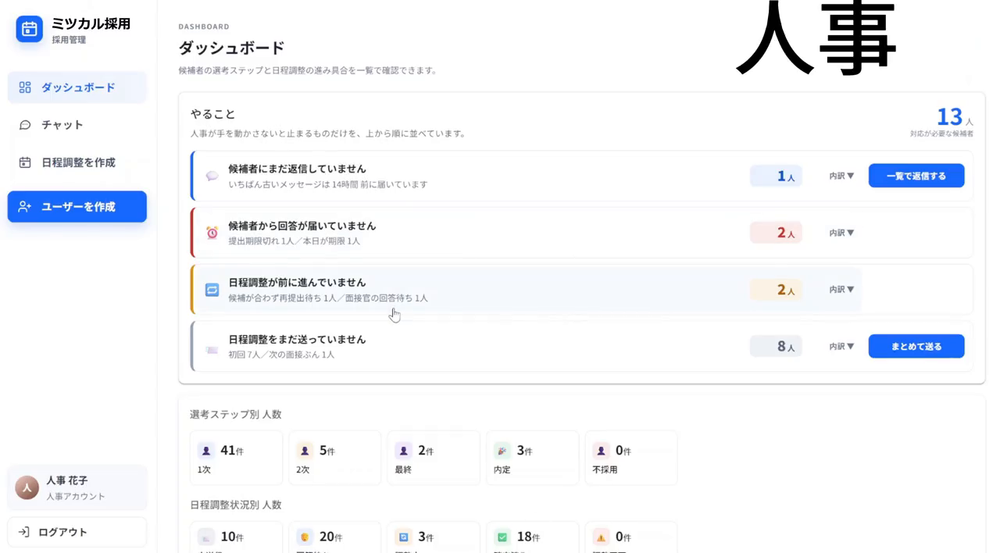
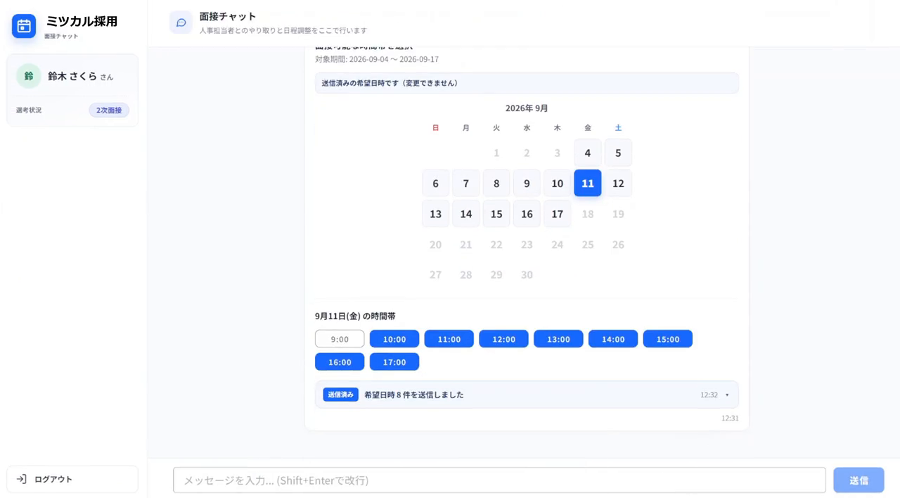
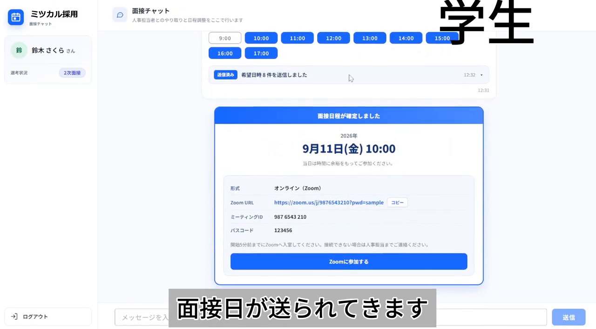
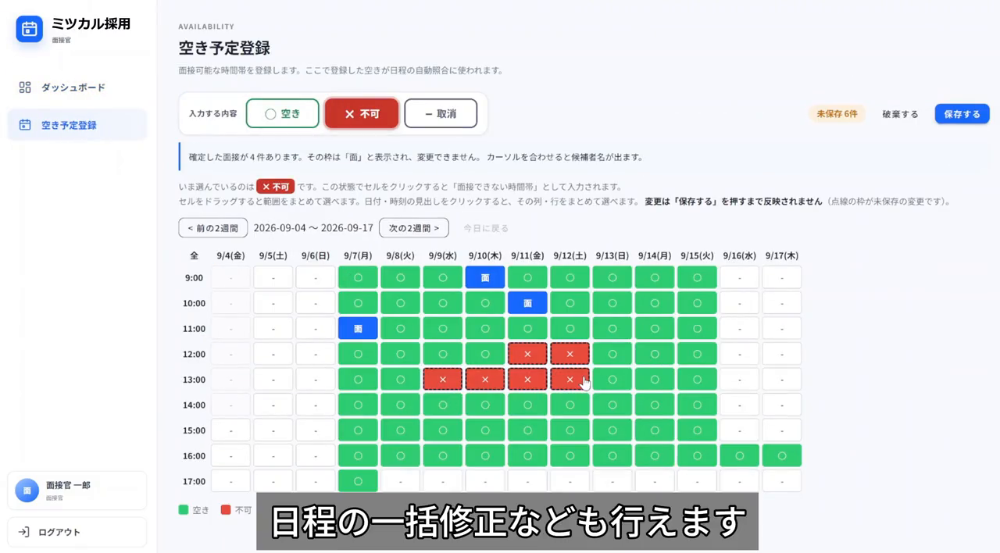
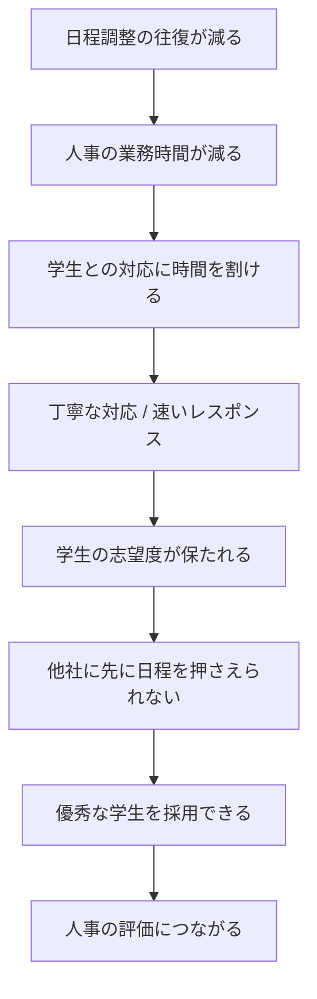
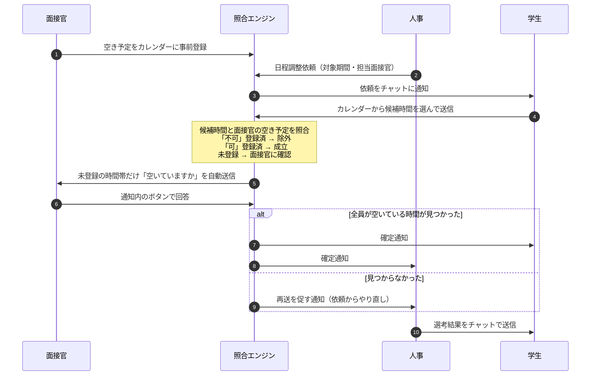

# ミツカル採用

面接の日程調整をチャット上で自動的に成立させる、新卒採用向けの Web アプリです。学生・人事・面接官の3者が同じチャットで完結し、サーバー側で「学生が出した候補時間」と「面接官の空き予定」を突き合わせて日程を確定させます。

3日間のハッカソン（2026年9月）で、何を作るかを決めるところから4人で作りました。

- 期間: 2026-09-02 〜 2026-09-04
- 技術: Vue 3 + Vuetify 3 / Socket.IO / Supabase (PostgreSQL) / Vite
- 実装は AI コーディングアシスタント（Claude Code / GitHub Copilot）で行っています

## デモ

面接官が承認したあと、サーバー側で日程が確定して学生に通知が届くまでです（22秒）。



通しの録画（2分25秒 / 音声なし）は **[デモページ](https://showgo1130.github.io/hackathon-t2-B/)** で再生できます。

| 人事のダッシュボード | 学生の候補提出 |
|---|---|
|  |  |
| 対応が必要な学生が上から並ぶ | チャット上のカレンダーから候補の時間を選ぶ |

| 自動で確定した通知 | 面接官の空き予定登録 |
|---|---|
|  |  |
| 全員が空いている時間が見つかると自動で送られる | 日付 × 時間帯で「空き / 不可」を登録しておく |

## 背景

テーマが決まっていないハッカソンだったので、まず何を解くかを決めるところから始めました。人事の方にヒアリングして出てきたのが次の話です。

- 学生一人ひとりに丁寧に対応したい
- ただ、面接の日程調整のような、学生以外とのやり取りに時間を取られている

面接を1件組むだけでも、「学生に候補日を聞く → 面接官に空きを確認する → 合わなければまた学生に聞く」という往復が何度も発生します。この往復をなくすことをゴールにしました。

## なぜこれを作る価値があるか

日程調整が速くなると最終的に何につながるのかを、チームで最初に整理しました。機能を作るかどうかは、この流れに効くかどうかで判断しています。



アプリが直接手を入れるのは一番上だけですが、最後は採用の結果まで届きます。人事が今日やるべきことを一覧で確認できるダッシュボードと、面接官の返信を待たずに候補を絞り込む自動照合を優先したのはこのためです。

## 進め方

1. 最初に動くモックを作って、何を作るのかをチーム全員で合わせた
2. そのうえで個人作業に分かれた
3. 終盤は画面を共有しながら、UI も含めてその場で決めていった

やってみて分かったのは、AI が実装を返す速度が速いぶん、詰まるのは「どうするかを決めるところ」になるということです。全員で同じ画面を見て即決すれば、そこで止まりません。認識を合わせ直すための会議も、後から作り直す時間も減りました。

## 作ったもの

| ロール | できること |
|---|---|
| 面接官 | 空き予定を「日付 × 時間帯」のカレンダーに事前登録する。届いた確認通知にボタンで答える |
| 人事 | 学生ごとに日程調整依頼（対象期間・担当面接官）を送る。ダッシュボードで全学生の進行状況を確認する。選考結果をチャットから送る |
| 学生 | チャット上に出るカレンダーから、対象期間内の都合のいい時間を選んで送る |

メールは送りません。通知はすべてアプリ内のチャット（Socket.IO）で完結します。

## 自動照合の仕組み

このアプリの中心になる部分で、`server/matching.js` が担当しています。



作るなかで決めたことです。

- 面接官の返信本文からは可否を判定しない。「空いていません」を肯定と取り違えるので、回答として扱うのは通知内のボタンだけにした
- 確定の直前にダブルブッキングを再確認する。照合の時点では空いていても、承認するまでの間に別の面接が入ることがある
- 面接官が複数指定されたときは、全員が空いている時間だけを確定にする
- チャットは会話ごとの Socket.IO room にした。ベースにした雛形は全クライアントへの broadcast だったので、学生ごと・面接官ごとのスレッドに作り替えている

## 技術構成

| 層 | 使用技術 |
|---|---|
| フロントエンド | Vue 3 (Composition API) / Vuetify 3 / Vue Router / Vite |
| リアルタイム通信 | Socket.IO（会話ごとの room） |
| サーバー | Vite の `configureServer` の中に Socket.IO サーバーを同居させている。ログインだけ `/api/login` を connect ミドルウェアで追加 |
| DB | Supabase (PostgreSQL) — 8テーブル（`sql/schema.sql`） |
| 認証 | bcrypt でハッシュ化したパスワード + JWT。Socket 接続時に `io.use()` で検証して `socket.data.user` に載せる |
| テスト | Node 標準のテストランナー（`node --test`、追加の依存なし） |

DB アクセスは `server/repositories/` に分けてあります。テストではこの下の Supabase クライアントだけをインメモリ実装（`tests/helpers/fakeSupabase.js`）に差し替えるので、DB 以外は本番と同じコードが動きます。

## AI の使い方

このハッカソンは AI コーディングアシスタントを使う前提の形式でした。今回は顧客の課題を解決することが主目的だったので、実装はすべて AI に任せていて、メンバーはコードを書いていません。コードレビューも AI にやらせています。

- 90コミット中44コミットに Claude の `Co-Authored-By`、8コミットに GitHub Copilot が入っています
- `SESSION_HANDOFF.md` は、AI のセッションをまたいで作業を引き継ぐためのメモです。確定した設計判断と変更したファイルを、次のセッションに渡す前提で書いています

人間側で持っていたのは、何を作るか、それが誰にどう効くか、どの順で進めるか、の判断です。

## 担当したところ

チームで作ったアプリです。終盤は全員で画面を共有しながら進めたので、コミット履歴上の分担は必ずしも個人の貢献量と一致しません。そのうえで、自分が主に手を入れたのは次の領域です。

- テスト一式（`tests/matching.test.js` / `tests/socketFlow.test.js` / `tests/e2e/scenario.test.js`）。照合エンジンの業務シナリオ、Socket.IO の実サーバー・実クライアント通し、実 DB に対する E2E
- 人事ダッシュボード（`HrDashboardPage.vue`）。全学生の進行状況と「やること」の一覧
- 面接官の空き予定カレンダー（`InterviewerCalendar.vue` / `InterviewerSchedule.vue`）。下書きしてから保存する方式、確定済み面接の表示、過去日時の編集防止
- 面接官側の Socket ハンドラと通知まわり（`socket_event/interviewer.js`）
- 照合エンジン（`server/matching.js`）のうち、可否の誤判定の修正と、確定直前のダブルブッキング再確認

認証（`server/auth.js`）と DB スキーマ（`sql/schema.sql`）は他のメンバーが担当しています。

## テスト

```bash
npm test          # DBに依存しないテスト（単体 + 照合エンジン + Socket.IO）
npm run test:e2e  # 実際のDBと開発サーバーに対する通しテスト
```

| ファイル | 内容 |
|---|---|
| `tests/unit/` | 認証、面接官の通知ストア |
| `tests/matching.test.js` | 照合エンジン。候補提出 → 空き確認 → 承認 → 確定、見送り、ダブルブッキング防止、複数学生の同時進行を、リポジトリ層まで本物のコードで検証する |
| `tests/socketFlow.test.js` | Socket.IO のハンドラを実サーバー・実クライアントで通しで検証する |
| `tests/e2e/scenario.test.js` | 実 Supabase と開発サーバーに対する業務シナリオ。人事のアカウント作成から空き登録・一括送信・候補提出・承認・確定・結果報告までを本番と同じ経路でなぞる |

## セットアップ

Node.js 22 LTS が必要です。

```bash
npm install

# Supabase のプロジェクトを用意し、sql/schema.sql を SQL Editor で実行する
cp .env.sample .env
#   SUPABASE_URL / SUPABASE_SERVICE_ROLE_KEY / JWT_SECRET を設定する

npm run seed        # 動作確認用のテストアカウントを投入（任意）
npm run demo:seed   # ダッシュボードのデモデータを投入（任意）
npm start           # http://localhost:3000/
```

DB の実データを触る前にバックアップを取れます。復元まで動作確認済みです。

```bash
npm run db:backup                     # backups/<日時>/ に全テーブルをJSONで保存
npm run db:restore -- backups/<日時>   # その時点の状態に戻す
```

`backups/` はメールアドレスやパスワードハッシュを含むので git 管理外です。

## このリポジトリについて

- ハッカソンの成果物を、主催企業の許諾を得たうえで公開しています
- ベースにしたチャットアプリの雛形（Vite + Vue 3 + Vuetify + Socket.IO の単一チャット）は主催企業から提供されたもので、その部分の著作権は同社にあります。詳しくは [LICENSE](LICENSE) を見てください
- 主催企業名は記載していません
- 公開にあたって、主催企業が配布した研修資料は除いてあります。コミット履歴に含まれていたメンバーの個人メールアドレスは GitHub の noreply アドレスに置き換えました
- 認証情報はリポジトリに含まれていません（`.env` は git 管理外、`.env.sample` はプレースホルダのみ）
