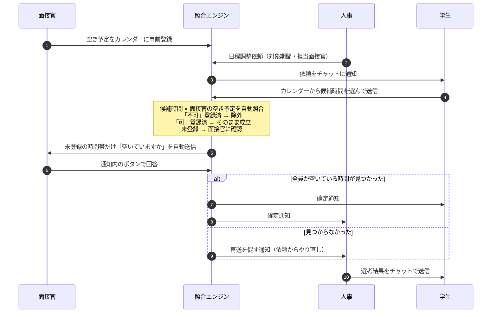

# ミツカル採用

**面接の日程調整を、チャット上で自動的に成立させる新卒採用管理アプリ。**

学生・人事・面接官の3者が同じチャットで完結し、サーバー側の照合エンジンが「学生の候補時間 × 面接官の空き予定」を突き合わせて、日程を自動で確定させます。

3日間のハッカソン（2026年9月）で、**何を作るかを決めるところから**チームで企画・実装したものです。

<!--
  ▼ここにスクリーンショット / デモ動画を追加する
  例:
  
-->

| | |
|---|---|
| **形式** | 3日間のハッカソン（企画・技術選定・実装・テストすべて参加者が決定） |
| **チーム** | 学生5名 |
| **期間** | 2026-09-02 〜 2026-09-04 / 90コミット |
| **技術** | Vue 3 + Vuetify 3 / Socket.IO / Supabase (PostgreSQL) / Vite |
| **開発手法** | AI駆動開発（Claude Code / GitHub Copilot） |

---

## 背景 — なぜこれを作ったか

テーマが与えられていなかったので、まず課題を選ぶところから始めました。

新卒採用の現場では、人事が1件の面接を組むために

> 学生に候補日を聞く → 面接官に空きを確認する → 合わなければもう一度学生に聞く

というチャットのラリーを何往復も繰り返しています。**本来いちばん時間をかけるべき候補者との対話に、その時間が回っていない。**

そこで「日程調整の往復を、人が判断しなくても成立するところまで自動化する」ことをゴールに置きました。単なるチャットアプリではなく、**チャットの裏側で照合を回すこと**が中心の設計です。

## 何ができるか

| ロール | できること |
|---|---|
| **面接官** | 自分の空き予定を「日付 × 時間帯」のカレンダーに事前登録する。届いた確認通知にボタンで答える |
| **人事** | 学生ごとに日程調整依頼（対象期間・担当面接官）を送る。「今日やること」ダッシュボードで全学生の進行状況を追う。選考結果をチャットからそのまま送る |
| **学生** | チャット上に出るカレンダーから、対象期間内の都合のいい時間を選んで送る |

実メールは一切送りません。すべての通知はアプリ内チャット（Socket.IO）で完結します。

## 自動照合の仕組み

このアプリの中核です。サーバー側の照合エンジン `server/matching.js` が担当します。



### 実装で判断したこと

- **面接官の返信本文からは可否を判定しない。** 「空いていません」を肯定と取り違えるため、回答として扱うのは通知内のボタンだけにしました。自然文の解釈に頼らないほうが壊れません
- **確定の直前にダブルブッキングを再確認する。** 照合時点では空いていても、承認までの間に別の面接が入る可能性があるため
- **複数の面接官が指定された場合は、全員が空いている時間だけを確定とする**
- **チャットは会話ごとの Socket.IO room。** ベース雛形の「全クライアントへの broadcast」方式は廃止し、学生ごと1本・面接官ごと1本の常設スレッドに作り替えました

## 技術構成

| 層 | 使用技術 |
|---|---|
| フロントエンド | Vue 3 (Composition API) / Vuetify 3 / Vue Router / Vite |
| リアルタイム通信 | Socket.IO（会話ごとの room） |
| サーバー | Vite の `configureServer` 内に Socket.IO サーバーを同居。ログインのみ `/api/login` を connect ミドルウェアで追加 |
| DB | Supabase (PostgreSQL) — 8テーブル（`sql/schema.sql`） |
| 認証 | bcrypt でハッシュ化したパスワード + JWT。Socket 接続時に `io.use()` で検証し `socket.data.user` に載せる |
| テスト | Node 標準テストランナー（`node --test`、追加依存なし） |

DB アクセスは `server/repositories/` にリポジトリ層として分離しています。テストではこの下の Supabase クライアントだけをインメモリ実装（`tests/helpers/fakeSupabase.js`）に差し替えるので、**DB 以外は本番と同じコードが動きます。**

## 自分の担当範囲

チーム全体90コミットのうち **43コミット / +8,112 −1,742行** を担当しました（チーム最多）。以下は git 履歴の実測に基づく内訳です。

**主に一人で作った部分**

- **テスト一式**（`tests/matching.test.js` / `tests/socketFlow.test.js` / `tests/e2e/scenario.test.js`、約1,800行）— 照合エンジンの業務シナリオ、Socket.IO の実サーバー・実クライアント通し、実DBに対するE2E
- **人事ダッシュボード**（`HrDashboardPage.vue`）— 全学生の進行状況と「今日やること」キュー
- **面接官の空き予定カレンダー**（`InterviewerCalendar.vue` / `InterviewerSchedule.vue`）— 下書きしてから保存する方式、確定済み面接の重畳表示、過去日時の編集防止
- **面接官側の Socket ハンドラ**（`socket_event/interviewer.js`）と通知ストア

**チームで分担した部分**

- **照合エンジン**（`server/matching.js`）— 3人で分担。可否の誤判定修正とダブルブッキングの再確認を担当
- **学生チャット**（`StudentChat.vue` / `ChatCalendarCard.vue` / `CalendarPicker.vue`）— カレンダーからの候補提出まわり

認証（`server/auth.js`）と DB スキーマ（`sql/schema.sql`）は他のメンバーの担当です。

## AI駆動開発について

本ハッカソンは AI コーディングアシスタントの活用を前提とした形式で、実装は Claude Code / GitHub Copilot と組んで進めました。履歴にそのまま残っています。

- 90コミット中 **44コミット**に Claude の `Co-Authored-By` トレーラー、**8コミット**に GitHub Copilot
- `SESSION_HANDOFF.md` は、AI セッションをまたいで作業を引き継ぐためのサマリー。設計判断の確定事項と変更ファイル一覧を人間側で管理していた記録です

生成させて終わりにせず、**要件の分解・設計判断・レビュー・テストによる検証を人間側で持つ**進め方をとりました。上の「実装で判断したこと」は、いずれも動いているコードに対してテストを書く過程で見つけて直したものです。

## テスト

```bash
npm test          # DBに依存しないテスト（単体 + 照合エンジン + Socket.IO）
npm run test:e2e  # 実際のDBと開発サーバーに対する通しテスト
```

| ファイル | 内容 |
|---|---|
| `tests/unit/` | 認証、面接官の通知ストア |
| `tests/matching.test.js` | 照合エンジン。候補提出 → 空き確認 → 承認 → 確定、見送り、ダブルブッキング防止、複数学生の同時進行を、リポジトリ層まで本物のコードで検証 |
| `tests/socketFlow.test.js` | Socket.IO ハンドラを実サーバー・実クライアントで通しで検証 |
| `tests/e2e/scenario.test.js` | 実 Supabase と開発サーバーに対する業務シナリオ。人事のアカウント作成から空き登録・一括送信・候補提出・承認・確定・結果報告までを本番と同じ経路でなぞる |

## セットアップ

Node.js 22 LTS が必要です。

```bash
npm install

# Supabase のプロジェクトを用意し、sql/schema.sql を SQL Editor で実行する
cp .env.sample .env
#   SUPABASE_URL / SUPABASE_SERVICE_ROLE_KEY / JWT_SECRET を設定する

npm run seed        # 動作確認用のテストアカウントを投入（任意）
npm run demo:seed   # ダッシュボードのデモデータを投入（任意）
npm start           # http://localhost:3000/
```

DB の実データを触る前にバックアップを取れます。復元まで動作確認済みです。

```bash
npm run db:backup                     # backups/<日時>/ に全テーブルをJSONで保存
npm run db:restore -- backups/<日時>   # その時点の状態に戻す
```

`backups/` はメールアドレスやパスワードハッシュを含むため git 管理外です。

## このリポジトリについて

- ハッカソンの成果物を、**主催企業の許諾を得たうえで**公開しています。無断公開ではありません
- ベースとなったチャットアプリの雛形（Vite + Vue 3 + Vuetify + Socket.IO の単一チャット）は主催企業から提供されたもので、その部分の著作権は同社に帰属します。詳細は [LICENSE](LICENSE) を参照してください
- **主催企業名は記載していません**
- 公開にあたり、主催企業が配布した研修資料は除外し、コミット履歴に含まれていたチームメンバーの個人メールアドレスは GitHub の noreply アドレスに置き換えています
- リポジトリに認証情報は一切含まれていません（`.env` は git 管理外、`.env.sample` はプレースホルダのみ）
